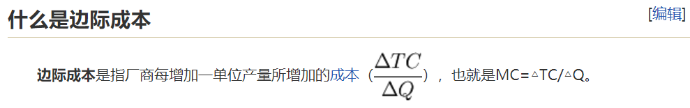

#27 系统架构
#架构概念
##模式分类：
+ 架构模式
+ 设计模式
+ 实现模式

边际成本：

##框架

#架构发展
##分布式文件系统
+ fastdfs
+ tfs
## APM
核心原理：java agent

场景视图
+ 用例视图
+ 逻辑视图
+ 开发视图
+ 进程视图
+ 物理视图

个人影响力
+ 职位影响力（虚）
+ 背景影响力（虚）
+ 技术影响力（实）

1.想了解是否能够说清楚现有的系统架构；
2.有没有思考，设计合理的地方，设计不合理的地方；

最新项目的技术、业务、架构、管理等